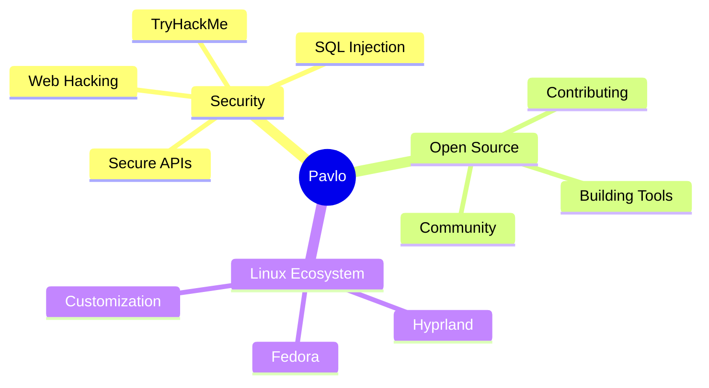

<div align="center">

# 👋 Hey, I'm Pavlo


<br/>

[](https://t.me/andrejdev)
[](https://yuzka.site)

</div>

<br/>

## 🚀 About Me

```typescript
const pavlo = {
  role: "Junior Software Developer",
  location: "🌍 Earth",
  workstation: {
    os: "Fedora Linux",
    wm: "Hyprland",
    shell: "fish",
  },
  interests: ["Cybersecurity", "DevOps", "Software Development"],
  currentProject: "AniUA & QShare",
  philosophy: "Code with purpose, optimize with precision",
};
```


<br/>

## 🛠️ Tech Arsenal

<div align="center">

### Languages


### Frameworks


### Infrastructure & Tools


### AI & Productivity


</div>

<br/>

## 🎯 Featured Projects

<div align="center">

<a href="https://github.com/suika-sensei/mullmer">
  
</a>
<a href="https://github.com/aniua-app/aniua">
  
</a>
<a href="https://github.com/suika-sensei/QShare">
  
</a>

</div>

<br/>

## 📊 GitHub Analytics

<div align="center">
  


</div>

<br/>

## 💡 Current Focus

<div align="center">



</div>

<br/>

<div align="center">

### 🌟 "Simplicity is the ultimate sophistication" - Leonardo da Vinci

---


**⭐ From [Suika-Sensei](https://github.com/suika-sensei)**

</div>
